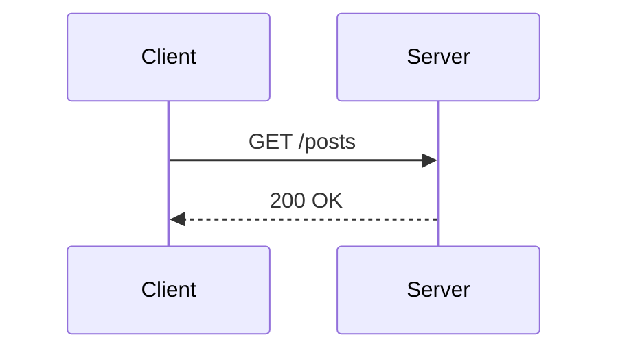

# 이미지 넣기

이미지는 **글이 속한 카테고리 폴더 아래 `images/`** 에 둔다. 글 옆에 두는 것이 원칙이다.

```
src/posts/개념-정리/
├── http-basics.md
└── images/
    └── tcp-handshake.png
```

본문에서는 **상대경로**로 참조한다.

```markdown

```

---

## 1. 규칙

| 항목 | 규칙 |
| :--- | :--- |
| 위치 | `src/posts/<카테고리>/images/` |
| 본문 참조 | `./images/<파일명>` — **이 형태만 동작한다** |
| 파일명 | 공백 금지. 하이픈을 쓴다 |
| 외부 이미지 | `https://...` 는 그대로 쓴다 (변환 없이 통과) |

### `./images/` 로 시작하지 않으면 깨진다

경로를 실제 번들 URL 로 바꿔주는 함수가 **`./images/` 로 시작하는 것만** 처리한다. 그 외(`/images/...`, `../images/...`, `images/...`)는 변환 없이 그대로 통과해서 **화면에서 깨진 이미지로 나온다.** 빌드는 성공하므로 눈으로 확인해야 안다.

### 왜 `public/` 이 아닌가

- 글과 이미지가 같은 폴더에 있어야 **글 단위로 옮기거나 지우기 쉽다**
- 빌드 시 파일명에 해시가 붙어 캐시 무효화가 자동으로 된다
- VS Code 마크다운 프리뷰에서 상대경로가 그대로 보인다

---

## 2. 커버 이미지

목록 카드의 대표 이미지는 frontmatter 로 지정한다. 본문 이미지와 **같은 경로 규칙**이다.

```markdown
---
title: HTTP 기초
date: 2026-04-05
cover: ./images/tcp-handshake.png
---
```

없으면 카테고리 첫 글자 letter-mark + 그라데이션이 자동으로 들어간다. 굳이 넣지 않아도 된다.

---

## 3. 다이어그램은 이미지 대신 mermaid

시퀀스 다이어그램·플로차트는 이미지 파일로 만들지 말고 코드블록으로 쓴다. 텍스트라 나중에 고치기 쉽고 저장소도 가볍다.

````markdown

````

렌더링 지원 범위는 [`engine/rendering.md`](../engine/rendering.md) 참조.

---

## 연관 도메인

| 도메인 | 관계 |
| :--- | :--- |
| [`frontmatter.md`](frontmatter.md) | `cover` 필드 |
| [`engine/rendering.md`](../engine/rendering.md) | 경로가 번들 URL 로 해석되는 구현, mermaid·lightbox |
