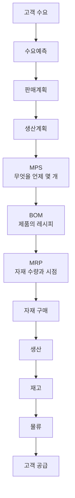
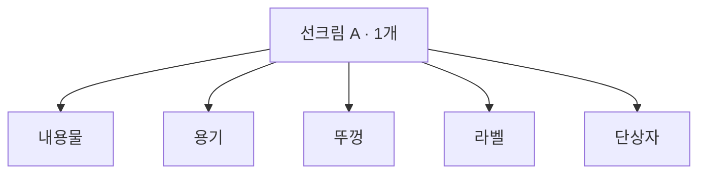

SCM을 준비하다 보면 생산관리, 수요관리, MRP, ERP, JIT 같은 용어를 계속 만난다. 하나씩 따로 외우면 복잡한데, 사실 전부 같은 질문에 매달려 있다.

> 고객이 원하는 제품을, 원하는 시점에 공급하려면 **무엇을 얼마나 생산하고 어떤 자재를 언제 준비할 것인가?**

이 질문을 축으로 놓으면 용어들이 흐름 위의 각 지점에 자리를 잡는다. 전체 그림은 이렇다.



이 글은 이 흐름을 왼쪽부터 따라간다.

## 생산관리 — 많이 만드는 게 목표가 아니다

기업이 생산에서 관리하는 것은 다섯 가지다.

| 요소 | |
| :--- | :--- |
| 품질 | Quality |
| 원가 | Cost |
| 납기 | Delivery |
| 생산량 | |
| 재고 | |

앞의 셋을 묶어 QCD라고 부른다. 정리하면 **좋은 제품을 적절한 비용으로 만들어 필요한 시점에 공급하는 것**이 목적이다.

여기서 곧바로 딜레마가 나온다. 너무 많이 만들면 재고가 남고 비용이 늘어난다. 너무 적게 만들면 품절이 나고 주문을 못 채운다. 그래서 결국 **얼마나 생산할 것인가**로 문제가 좁혀진다.

### 언제 만드느냐 — MTS와 MTO

생산 방식은 주문을 받기 전에 만드느냐, 받은 뒤에 만드느냐로 갈린다.

| | MTS (Make To Stock) | MTO (Make To Order) |
| :--- | :--- | :--- |
| 시점 | 주문 전 미리 생산 | 주문 후 생산 |
| 근거 | 수요예측 | 확정된 주문 |
| 대표 사례 | 화장품·식품·생활용품 등 반복 판매되는 소비재 | 주문 사양이 갈리는 제품 |
| 강점 | 주문 즉시 출고 | 재고 부담이 적음 |
| 약점 | 판매가 부진하면 재고가 남음 | 납기가 길어짐 |
| 관건 | **수요예측 정확도** | **납기 관리** |

MTS는 재고 위험이 크고 MTO는 납기 관리가 중요하다. 제품 특성과 고객 요구에 따라 고른다.

## 출발점은 수요다

"다음 달에 10만 개 만들자"를 근거 없이 정할 수는 없다. 얼마나 팔릴지를 먼저 봐야 한다. 그래서 SCM에서 **수요관리(Demand Management)** 가 앞에 온다.

화장품 회사라면 이런 것들을 본다.

- 과거 판매량, 계절성
- 신제품 출시, 광고·프로모션
- 할인 행사 — 올리브영 세일 같은 채널 이벤트
- 경쟁사 상황, 시장 성장률

이걸 근거로 앞으로의 판매량을 잡는 게 **수요예측(Demand Forecasting)** 이다.

### 예측은 틀린다

예측은 어디까지나 예측이라 실제 판매량과 정확히 맞기 어렵다.

| 예측 | 실제 | 결과 |
| :--- | :--- | :--- |
| 10,000개 | 15,000개 | 재고 부족 → 품절 |
| 10,000개 | 5,000개 | 재고 과잉 → 비용 |

그래서 SCM은 예측을 맞히는 게임이 아니라 **예측 정확도와 재고 수준 사이의 균형**을 잡는 일에 가깝다.

### 생산계획은 예측치가 아니다

예상 판매량이 10,000개라고 10,000개를 새로 만들지 않는다. 창고에 이미 있는 재고를 빼야 한다.

```
예상 판매량 10,000개
현재 재고    3,000개
```

여기에 안전재고와 입고 예정 물량까지 함께 본다.

## 계획을 숫자로 — MPS · BOM · MRP

### MPS — 어떤 완제품을 언제 몇 개

**MPS(Master Production Schedule)**, 주생산일정계획 또는 기준생산계획이다. 완제품 단위로 언제 몇 개를 만들지 정한다.

| 제품 | 생산계획 |
| :--- | ---: |
| 선크림 A | 10,000개 |
| 토너 B | 5,000개 |
| 크림 C | 7,000개 |

여기서 새 문제가 생긴다. 제품을 만들려면 원재료와 부품이 있어야 한다.

### BOM — 제품의 레시피

선크림은 내용물만 있다고 완성되지 않는다. 제품을 구성하는 원재료·부품 목록이 **BOM(Bill of Materials)**, 자재명세서다. 쉽게 말해 레시피다.



선크림 한 개에 용기·뚜껑·라벨·단상자가 각 1개씩 들어간다면, 10,000개를 만들려면 각각 10,000개가 필요하다.

### MRP — 무엇이, 얼마나, 언제

**MRP(Material Requirements Planning)**, 자재소요계획이다. 답하려는 질문은 셋이다.

> 무엇이 필요한가? · 얼마나 필요한가? · **언제** 필요한가?

MPS에서 완제품 생산량이 정해지면 BOM으로 필요한 자재 수량을 계산한다. MPS·BOM·재고정보를 입력으로 받아 필요 자재와 발주 시기를 뽑아내는 구조다.

여기서 중요한 건 **단순히 생산량 × 소요량이 아니라는 것**이다. 이미 가진 것과 들어올 것을 뺀다.

| | 수량 |
| :--- | ---: |
| 총소요량 (선크림 10,000개 × 용기 1개) | 10,000 |
| − 현재 재고 | 3,000 |
| − 입고 예정량 | — |
| **= 실제 발주 필요량** | **7,000** |

이 차감 덕분에 불필요한 구매와 과잉재고가 줄어든다.

### 리드타임 — 필요한 날 주문하면 늦는다

발주하고 실제로 도착하기까지 걸리는 시간이 **리드타임(Lead Time)** 이다.

중국에서 화장품 용기를 수입하는 데 30일이 걸린다면, 5월 1일 생산에 쓸 용기를 5월 1일에 주문해서는 안 된다. MRP는 리드타임을 반영해 **주문 시점을 역산한다.**

그래서 MRP는 수량 계산기가 아니라 **수량 + 시점**을 함께 다루는 개념이다.

### 독립수요와 종속수요

| | 독립수요 | 종속수요 |
| :--- | :--- | :--- |
| 무엇이 결정하나 | 외부 고객의 수요 | 다른 제품의 생산량 |
| 예 | 선크림 완제품 10,000개 | 그 선크림에 들어가는 용기 10,000개 |
| 어떻게 얻나 | **예측해야 한다** | **계산하면 된다** (BOM) |
| 대상 | 완제품 | 부품·원재료 |

용기 수요를 따로 예측할 필요가 없다는 게 핵심이다. MRP는 이 종속수요를 BOM으로 계산한다.

## Push와 Pull — MRP와 JIT

### MRP는 Push

예상 수요와 생산계획을 기준으로 미리 만들어 밀어낸다. **예측 → 계획 → 생산**의 구조다. 계획적인 생산이 가능하지만, **예측이 틀리면 그대로 과잉재고가 된다.**

### JIT는 Pull

**JIT(Just In Time)** 의 원칙은 한 줄이다.

> 필요한 것을, 필요한 시점에, 필요한 만큼 생산한다.

불필요한 재고를 갖지 않는 것이 철학이고, 도요타 생산방식과 함께 알려져 있다.

| | Push (MRP) | Pull (JIT) |
| :--- | :--- | :--- |
| 신호 | 예측된 수요 | 실제 발생한 필요 |
| 방향 | 앞 공정 → 뒤 공정으로 밀어냄 | 뒤 공정이 앞 공정에서 당겨옴 |
| 한마디 | "1,000개 필요할 것 같으니 만들어 두자" | "지금 100개 필요하니 100개 달라" |
| 재고 | 쌓아두고 대응 | 최소로 유지 |
| 약점 | 예측이 틀리면 과잉재고 | 공급이 끊기면 바로 멈춤 |

### 칸반

후공정이 앞 공정에 "이 부품이 이만큼 필요하다"고 보내는 신호가 **칸반(Kanban)** 이다. 이 신호에 맞춰서만 만들거나 공급한다. 생산량을 예측이 아니라 **실제 사용량**에 연결하는 장치다.

### JIT의 값과 대가

재고가 줄면 따라오는 것들이 있다.

- 창고비 감소
- 재고관리비 감소
- 자금 효율 향상
- 불필요한 생산 감소
- 재고 노후화 위험 감소

결국 **낭비를 줄이는 것**이 목적이다. 다만 재고가 적다는 건 **문제가 생겼을 때 버틸 여유가 없다는 뜻**이기도 하다. 공급업체에서 자재가 끊기면 생산이 바로 멈춘다. 그래서 JIT를 굴리려면 전제가 필요하다.

> 안정적인 공급업체 · 짧은 리드타임 · 높은 품질 · 정확한 생산관리 · 안정적인 물류

이게 안 받쳐주면 JIT는 위험만 늘린다. **재고를 무조건 줄이는 게 항상 최선은 아니다.**

### 그래서 안전재고

재고는 비용이지만 동시에 기업을 보호한다. 주문이 갑자기 늘었을 때 재고가 없으면 품절이고, 공급업체에 문제가 생겼을 때 재고가 없으면 생산이 멈춘다.

예상하지 못한 수요 증가나 공급 지연에 대비해 추가로 들고 있는 재고가 **안전재고(Safety Stock)** 다. 재고는 나쁜 게 아니라 **적정 수준을 유지하는 것**이 문제다.

## 범위가 넓어진다 — MRP II, 그리고 ERP

### MRP II

초기 MRP는 **자재**에 집중했다. 그런데 자재만 있다고 제품이 나오지 않는다. 설비와 사람도 있어야 한다.

원재료는 충분한데 설비가 하루 1,000개밖에 못 만드는 상황에서 생산계획이 10,000개라면 그 계획은 실행되지 않는다.

그래서 관리 범위를 자재 · 설비 · 생산능력 · 인력으로 넓힌 것이 **MRP II(Manufacturing Resource Planning)**, 제조자원계획이다.

### ERP

범위가 더 넓어지면 **ERP(Enterprise Resource Planning)**, 전사적 자원관리가 된다. 회사에는 생산팀만 있는 게 아니다 — 구매·생산·물류·영업·회계·재무·인사·재고가 전부 얽혀 있다.

주문 하나가 어떻게 부서를 타고 흐르는지 보면 왜 통합이 필요한지 분명해진다.


ERP는 이 정보를 하나로 묶어 **모든 부서가 같은 데이터를 보고 일하게** 만든다. 생산·재무·인사 등 전사 자원을 통합 관리하면서 MRP 기능도 안에 품고 있는 정보시스템이라고 이해하면 된다.

### MRP와 ERP의 차이

| | MRP | ERP |
| :--- | :--- | :--- |
| 범위 | 생산에 필요한 **자재** | 기업 **전체**의 자원 |
| 핵심 질문 | 어떤 자재가 얼마나, 언제 필요한가? | 구매·생산·재고·물류·판매·회계·인사를 어떻게 하나로 연결할까? |

포함 관계로 보면 **MRP ⊂ ERP** 다.

## SCM — 회사 밖까지 이어붙이기

생산관리만 잘한다고 전체가 최적화되지는 않는다. 공장에서 완벽하게 만들어도 고객에게 닿지 않으면 의미가 없다. 그래서 관리 범위가 계속 밖으로 밀려난다.

> 자재관리 → 생산관리 → 기업 내부 통합(ERP) → **외부 공급업체와 고객까지(SCM)**

**SCM(Supply Chain Management)**, 공급망관리는 제품이 고객에게 도달하기까지의 전 과정을 하나의 시스템으로 본다.


### 공급망에서 움직이는 세 가지

| 흐름 | 무엇이 | 방향 |
| :--- | :--- | :--- |
| 물자 | 원재료·제품 | 공급업체 → 제조 → 물류센터 → 고객 |
| 정보 | 주문·판매·재고 정보 | **양방향** |
| 돈 | 대금 | 고객 → 공급자 (제품과 **반대**) |

### 정보 공유가 없으면 채찍이 휘둘린다

판매점에서 "이번 주 선크림 판매가 급증했다"는 정보를 제조사가 빨리 받으면 생산계획을 바로 조정할 수 있다. 반대로 실제 판매 정보가 안 보이면 각 기업이 **눈앞의 주문만 보고** 판단한다.

그 결과가 **채찍효과(Bullwhip Effect)** 다. 최종 고객 수요는 조금 변했는데 공급망 상류로 갈수록 주문 변동이 증폭된다.

| 단계 | 주문량 | 왜 |
| :--- | ---: | :--- |
| 소비자 실수요 | 100 → 110 | 실제로는 10%만 증가 |
| 소매점 | 120 | 품절이 걱정돼 더 시킴 |
| 도매업체 | 140 | 더 부족할까 봐 더 시킴 |
| 제조업체 | 160 | 그에 맞춰 생산 |

수요는 10% 늘었는데 공급망 전체의 생산량과 재고는 크게 부풀었다. 그래서 SCM에서 **정확한 정보 공유**가 그렇게 강조된다.

### 개별 최적화 ≠ 전체 최적화

각 부서가 자기 기준으로 최적을 택해도 전체는 나빠질 수 있다.

| 부서 | 그 부서 기준의 합리적 판단 | 전체로 보면 |
| :--- | :--- | :--- |
| 구매 | 많이 사면 단가가 싸다 → 대량구매 | 재고 증가, 창고비 증가, 자금이 묶임 |
| 생산 | 한 번에 많이 만들면 생산단가가 싸다 | 안 팔리면 그대로 재고 |

그래서 SCM은 특정 부서가 아니라 **공급망 전체의 비용과 효율**을 본다.

## SCM 직무는 결국 무엇을 보는가

배송만 하는 직무가 아니다. 수요와 판매계획을 파악하고, 현재 재고를 확인하고, 필요한 생산량을 계산하고, 자재를 확보하고, 적정 재고를 유지하면서, 제품이 제시간에 고객에게 닿게 만든다.

그래서 실무에서 중요한 건 개별 지식보다 **연결관계**다.

> 수요 → 생산 → 구매 → 재고 → 물류 → 판매

## 용어 한 번에 정리

| 용어 | 의미 | 핵심 질문 |
| :--- | :--- | :--- |
| Demand Forecast | 수요예측 | 앞으로 얼마나 팔릴까? |
| MPS | 기준생산계획 | 완제품을 언제 얼마나 만들까? |
| BOM | 자재명세서 | 제품 하나를 만들려면 무엇이 필요한가? |
| MRP | 자재소요계획 | 어떤 자재가 언제 얼마나 필요한가? |
| MRP II | 제조자원계획 | 자재뿐 아니라 설비·인력까지 충분한가? |
| ERP | 전사적 자원관리 | 회사 전체의 자원을 어떻게 연결할까? |
| JIT | 적시생산 | 필요한 것을 필요한 순간에 필요한 만큼 공급할 수 있을까? |
| Safety Stock | 안전재고 | 예상하지 못한 상황에 대비해 얼마를 보유할까? |
| SCM | 공급망관리 | 공급망 전체를 어떻게 최적화할까? |

## 한 줄로 다시

1. 고객이 얼마나 살지 **예측한다**
2. 그 수요에 맞춰 **생산량을 결정한다**
3. **MPS** 로 어떤 제품을 언제 얼마나 만들지 계획한다
4. **BOM** 으로 제품에 들어가는 자재를 확인한다
5. **MRP** 로 필요한 자재의 수량과 시점을 계산한다
6. **리드타임과 현재 재고**를 고려해 구매한다
7. 생산하고 **적정 재고**를 유지한다
8. **JIT** 같은 방식으로 불필요한 재고와 낭비를 줄인다
9. **ERP** 로 사내 구매·생산·영업·회계 정보를 통합한다
10. 공급업체부터 최종 고객까지 범위를 넓히면 **SCM** 이 된다

물류 하나, 재고 하나를 잘 관리하는 게 SCM이 아니다. **수요정보를 출발점으로 구매·생산·재고·물류·판매를 하나의 흐름으로 보고 전체를 최적화하는 것** — 이게 핵심이다.
