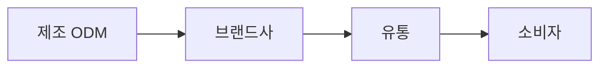

> 예시 글입니다. 내용을 지우고 직접 채우세요.

## 왜 보게 됐나

무엇을 하다가 이 산업을 들여다보게 됐는지.

## 시장 구조

```mermaid
flowchart LR
    ODM[제조 ODM] --> 브랜드사 --> 유통 --> 소비자
```

## 숫자

출처를 반드시 적는다. 근거 없는 수치는 쓰지 않는다.

| 항목 | 값 | 출처 |
| :--- | :--- | :--- |
| | | |

## 내 생각

## 참고
